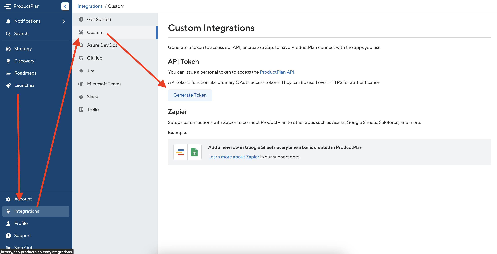

# ProductPlan Ideas Slack Bot

This example project demonstrates submitting ideas to [ProductPlan](https://www.productplan.com/) through Slack using AWS infrastructure. This project is for **demonstration purposes only**. It is **not production ready** and any code should be used **at your own risk.**

[ProductPlan](https://www.productplan.com/) allows you to effortlessly craft and communicate strategic roadmaps. [Book a consultation](https://go.productplan.com/enterprise-demo/) today to learn more!

## Overview

This project shows the configuration, code, and setup necessary to build a bot in Slack and submit ideas captured by that bot to ProductPlan. It uses AWS infrastructure to standardize ideas and submit them to ProductPlan. AWS infrastructure is deployed using GitHub Actions.

We will briefly discuss the parts of the project and then walk through setup. If you want to skip right to the code, much of the magic happens in [src/handlers/execute-slack-event.ts](https://github.com/ProductPlan/productplan-ideas-slack-botblob/main/src/handlers/execute-slack-event.ts), where it submits ideas to the [ProductPlan API](https://productplan.readme.io/reference/post_api-v2-discovery-ideas).

### AWS

This project uses AWS infrastructure to respond to Slack events and submit ideas to ProductPlan. We will use the following AWS services:

- [Lambda](https://aws.amazon.com/lambda/) - We will host our code as in AWS Lambda. It is serverless and will only run on demand.
- [API Gateway](https://aws.amazon.com/api-gateway/) - API Gateway will generate an endpoint and route requests to our Lambda.
- [DynamoDB](https://aws.amazon.com/dynamodb/) - DynamoDB is a serverless NoSQL database with built-in record cleanup. We will use it to store data about conversation sessions, allowing our bot to remember information it has already ascertained.
- [Bedrock](https://aws.amazon.com/bedrock/) - We will use AI through Bedrock to identify ideas in natural text and translate them into JSON our code can consume. Our AI model will be [Claude Sonnet 3.7](https://www.anthropic.com/claude/sonnet).
- [CloudFormation](https://aws.amazon.com/cloudformation/) - CloudFormation will manage our AWS infrastructure.

Addtionally, our code uses [AWS Serverless Application Model](https://aws.amazon.com/serverless/sam/) to handle some of the complexities of Lambda development.

### Slack

We will create a bot in our Slack account for submitting ideas to ProductPlan. To prevent confusion, users will be requird to mention (@) the bot for it to respond. The bot will require the following OAuth Scopes:

- `app_mentions:read` - We need to recognize when the bot is mentioned (@)
- `chat:write` - The bot will respond in chat
- `users:read` - Our code will query Slack to determine the name of the submitting user
- `users:read.email` - The user's email address is a required field for ProductPlan ideas

### ProductPlan

To submit to ProductPlan, we will need an API key from our account.

### GitHub Actions

We will use GitHub Actions to compile and deploy the Lambda and its associated infrastructure. If we didn't want to use GitHub Actions, we could review the steps in [.github/workflows/pipeline.yaml](https://github.com/ProductPlan/productplan-ideas-slack-botblob/main/.github/workflows/pipeline.yaml) and manually deploy by substituting in the appropriate values.

## Setup

Because this project is for demonstration purposes only, we will make several assumptions. The first assumption we will make is we have an active [ProductPlan account](https://app.productplan.com/users/sign_in). If you don't have a ProductPlan account, [book a consultation](https://go.productplan.com/enterprise-demo/) to find out how ProductPlan can benefit you and your team!

We will assume we have an [AWS account](https://console.aws.amazon.com/) and know how to configure it. We also assume we have forked this repository into our own [GitHub account](https://github.com/) and have an active [Slack account](https://slack.com/) with access to [manage apps](https://slack.com/help/articles/1500009181142-Manage-app-settings-and-permissions).

### ProductPlan API token

When logged into our ProductPlan account, we select `Integrations` along the left nav, then select `Custom` and choose to `Generate Token`.

 Custom -> Generate Token" />

**IMPORTANT:** We will need the generated API token when setting up GitHub Actions.

### AWS infrastructure

In order to deploy AWS infrastructure, our pipeline needs permission to effect changes to our AWS account. We will create one user and two roles with the permissions required for deployment. We also need an S3 bucket to hold the code associated with our Lambda.

#### S3 bucket

We need an S3 bucket to hold the Lambda code, though we could also use an existing bucket. Because S3 buckets must be globally unique -- we can't use a bucket name another organiazation uses -- a good name for us might be `productplan-lambda-source`.

**IMPORTANT:** We will need the name of this bucket when setting up GitHub Actions.

#### CloudFormation role

We need a role for CloudFormation to assume that is allowed to create resources. Because this is a demonstration project, we will give the role full permissions, but that is not appropriate for production-ready projects.

Name: `deployment-cloudformation`

Managed policy ARNs:

- `arn:aws:iam::aws:policy/IAMFullAccess`
- `arn:aws:iam::aws:policy/PowerUserAccess`

**IMPORTANT:** We will need the ARN of this role when setting up GitHub Actions.

#### Pipeline role

We need a role for the pipeline to assume. This role will need to upload Lambda code to S3 be able to assume the cloudformation role. We'll need to replace `<AWS_account_id>` with our AWS account number and `<Lambda_S3_bucket>` with the name of our S3 bucket for Lambda code.

Name: `deployment-pipeline`

Policy JSON:

```json
{
  "Version": "2012-10-17",
  "Statement": [
    {
      "Action": "iam:PassRole",
      "Resource": "arn:aws:iam::<AWS_account_id>:role/deployment-cloudformation",
      "Effect": "Allow"
    },
    {
      "Action": "cloudformation:*",
      "Resource": "*",
      "Effect": "Allow"
    },
    {
      "Action": ["s3:DeleteObject", "s3:GetObject*", "s3:PutObject*", "s3:GetBucket*", "s3:List*"],
      "Resource": ["arn:aws:s3:::<Lambda_S3_bucket>/*", "arn:aws:s3:::<Lambda_S3_bucket>"],
      "Effect": "Allow"
    }
  ]
}
```

**IMPORTANT:** We will need the ARN of this role when setting up GitHub Actions.

#### Pipeline user

Finally, we'll create a user that can assume the roles we created. Again, we'll need to replace `<AWS_account_id>` with our AWS account number when creating a policy for the user.

Name: `productplan-ideas-slack-bot`

Policy JSON:

```json
{
  "Version": "2012-10-17",
  "Statement": [
    {
      "Action": ["iam:Get*", "iam:List*"],
      "Resource": "*",
      "Effect": "Allow"
    },
    {
      "Action": "sts:AssumeRole",
      "Resource": ["arn:aws:iam::<AWS_account_id>:role/deployment-pipeline"],
      "Effect": "Allow"
    }
  ]
}
```

**IMPORTANT:** We should generate an AWS CLI access key and secret access key for the user. We will use those values when setting up GitHub Actions. AWS CLI keys are used in this project for demonstration purposes, but are not appropriate for production-ready projects.

### Slack app

We will need to create an app in Slack in order to generate some configuration values for GitHub Actions. We will set permissions now and then come back in a later step to hook the Slack app up to our Lambda.

#### Create app

On the [create app page](https://api.slack.com/apps), we can select to create a new app from scratch. We are calling our app `ProductPlan Ideas Capture` and are creating it in our own workspace.


Once the app has been created, we will be presented with a page including the app ID.


**IMPORTANT:** We will need the app ID when setting up GitHub Actions.

#### Set OAuth Scope

Using the left nav to find `OAuth & Permissions`, we can scroll down and choose to `Add an OAuth Scope`.


We need to grant the following OAuth Scopes:

- `app_mentions:read` - We need to recognize when the bot is mentioned (@)
- `chat:write` - The bot will respond in chat
- `users:read` - Our code will query Slack to determine the name of the submitting user
- `users:read.email` - The user's email address is a required field for ProductPlan ideas


#### Install app

Scrolling back up on the same `OAuth & Permissions` screen, we can select to install this app into our workspace.


Once we grant the required permissions and the app is installed, we will find a `Bot User OAuth Token` on the page.


**IMPORTANT:** We will need the `Bot User OAuth Token` when setting up GitHub Actions.

### GitHub Actions pipeline

We need to configure [GitHub Actions](https://github.com/features/actions) with the details of our AWS account. This allows it to deploy our infrastructure while securely storing values. In a production environment, we would likely use [AWS Secrets Manager](https://aws.amazon.com/secrets-manager/) rather than environment variables to store secrets.

We need to create the following GitHub Actions secrets:

- `AWS_ACCESS_KEY_ID` - Access key for the [pipeline user](#pipeline-user)
- `AWS_SECRET_ACCESS_KEY` - Secret access key for the [pipeline user](#pipeline-user)
- `AWS_S3_ARTIFACTS_BUCKET` - The name of the [S3 bucket](#s3-bucket) -- not ARN -- of the bucket used to store the Lambda's code, for example `productplan-lambda-source`
- `CLOUDFORMATION_ROLE_ARN` - The ARN for our [CloudFormation role](#cloudformation-role), in the format `arn:aws:iam::<AWS_account_id>:role/deployment-cloudformation`
- `PIPELINE_ROLE_ARN` - The ARN for our [pipeline role](#pipeline-role), in the format `arn:aws:iam::<AWS_account_id>:role/deployment-pipeline`
- `PRODUCTPLAN_API_TOKEN` - Our [ProductPlan API token](#productplan-api-token)
- `SLACK_APPLICATION_ID` - The app ID of our [Slack app](#create-app)
- `SLACK_OAUTH_TOKEN` - The `Bot User OAuth Token` of our [Slack app](#install-app)

Once these settings are correctly configured, a push to `main` in our repo will trigger a deploy of our AWS infrastructure. We will go ahead and push up our code to trigger the first build. Once the build has completed, we will use the output of that build to finish configuring our Slack app.

When we navigate to the `Actions` tab in our GitHub repo, we can select the `Deploy lambda` job, expand the `Deploy to account` step, then scroll to the bottom of that output to find the value of `HttpApiUrl`.

 Actions -> Deploy lambda -> Deploy to account -> scroll to bottom -> HttpApiUrl" />

**IMPORTANT:** We will need the `HttpApiUrl` output of a successful GitHub Actions deployment when finalizing the configuration of our Slack app.

### Slack app subscriptions

Once our code has been deployed to AWS and is ready to accept traffic, we need to configure Slack to send traffic to our endpoint. If we navigate to `Event Subscriptions` on the left nav and choose to `Enable Events`, we can use the `Add Bot User Event` button to subscribe to the `app_mention` event.


When we deployed our code with [GitHub Actions](#github-actions-pipeline), we received as output in the pipeline a URL. It should be in the format `https://<API_gateway_id>.execute-api.us-east-1.amazonaws.com/v1`. We can add our Lambda's path (`/slack-events`) to that base URL to create the URL for our Slack bot in the format `https://<API_gateway_id>.execute-api.us-east-1.amazonaws.com/v1/slack-events`. We will use that URL for the value of `Request URL` on the event subscriptions page.


If all goes well, we will see the text `Verified` with a green check. If all does not go well, we'll need to double-check our URL and look at our Lambda's logs to see if we forgot any part of the setup.

## Usage

To interact with our new bot, we can mention (@) it in any channel -- public or private -- in a workspace where the app is installed. Remember **the bot will not be able to respond until it has been added as a member of the channel.** The bot will always respond in a thread, but **you must mention (@) the bot each time you want a reply.** It will not automatically reply to messages in a thread without being mentioned. We also configured the bot to **forget conversations after 24 hours.** After 24 hours, we should start a new thread with the bot rather than continue an existing thread.

Here is an example conversation:


That conversation generated the following idea in ProductPlan:


## Conclusion

While this project is not quite production-ready, we were able to successfully retrieve an API token from ProductPlan, install a custom app into Slack, deploy a new Lambda to AWS, configure our Lambda to subscribe to Slack events, and finally mention (@) our bot to submit an idea to our ProductPlan account.

Because it is for demonstration only, ProductPlan does not offer support for this repository, but we encourage you to [book a consultation](https://go.productplan.com/enterprise-demo/) for a personalized exploration of the benefits of using ProductPlan for your business strategy!
